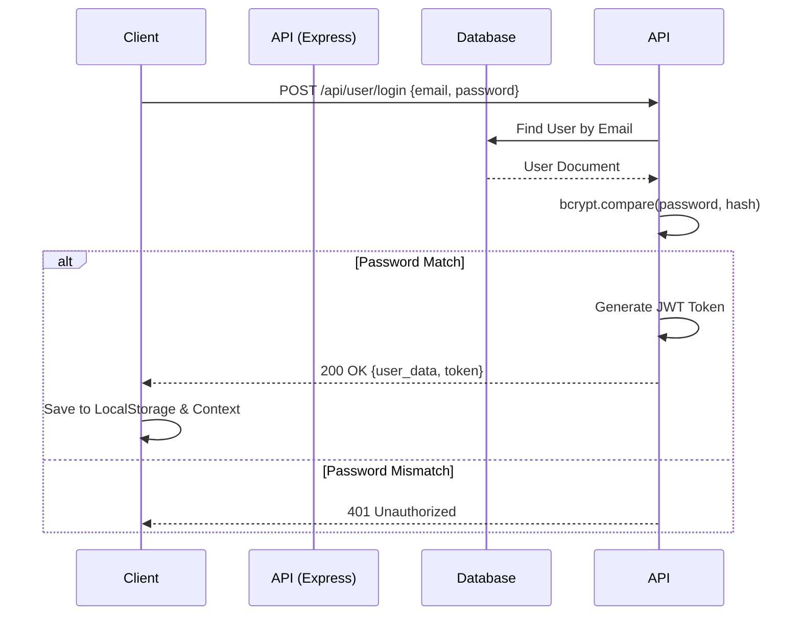
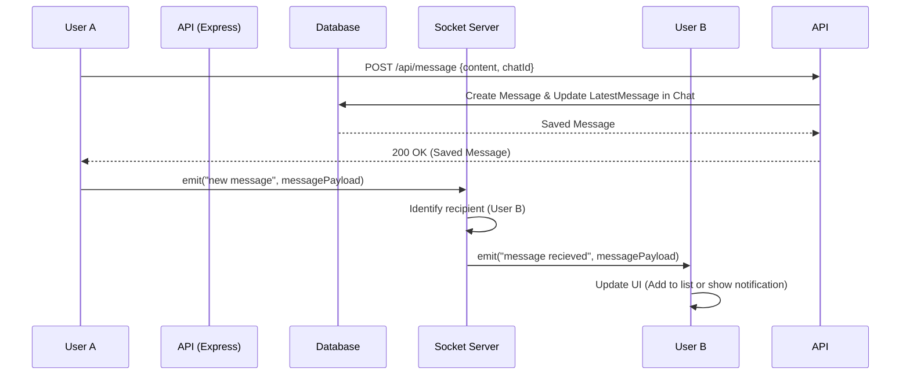

# DELTA_V1 Architecture & Technical Documentation

This document provides a deep, technical dive into the **DELTA_V1** real-time chat application. It is designed for developers, contributors, and recruiters who want to understand the system's inner workings, architecture, and design decisions.

---

## A. Complete System Architecture

DELTA_V1 follows a standard **MERN Stack** (MongoDB, Express, React, Node.js) architecture augmented with **Socket.IO** for real-time bidirectional communication.

### High-Level Architecture
1. **Client (Frontend)**: React SPA (Single Page Application) styled with Chakra UI. It manages state globally using React Context (`ChatProvider`) and establishes a persistent WebSocket connection to the backend.
2. **Server (Backend)**: Express.js REST API running on Node.js. It handles HTTP requests (authentication, fetching chats/messages) and manages WebSocket connections using Socket.IO.
3. **Database**: MongoDB (via Mongoose), serving as the persistent data store for users, chats, and messages.

### Request-Response Lifecycle (Standard API)
1. Client makes an HTTP REST call (e.g., `GET /api/chat`).
2. Express Router intercepts the request.
3. `authMiddleware` verifies the JWT token (if protected).
4. Controller handles the business logic and queries MongoDB via Mongoose models.
5. JSON response is sent back to the client.

### Real-Time Communication Architecture
- **Persistent Connection**: Client connects to the server via Socket.IO upon mounting the chat interface.
- **Personal Rooms**: On `setup`, each client joins a Socket.IO room named after their unique `userId`. This allows the server to target specific users regardless of which chat window they currently have open.
- **Chat Rooms**: When a user opens a specific chat, they emit a `join chat` event to join a room specific to that `chatId` (useful for typing indicators).
- **Message Dispatch**: When User A sends a message to User B, it is first saved to the database via a standard POST request. The server responds with the saved message. User A's client then emits a `new message` socket event containing the message payload. The server receives this and broadcasts it to the personal rooms of all other users in that chat.

---

## B. Workflow Diagrams

### 1. Authentication Flow

### 2. Real-Time Message Sending Flow

---

## C. Folder-by-Folder Explanation

### Root Directory
- `.env`: Environment variables (Port, MongoDB URI, JWT Secret).
- `.gitignore`: Prevents sensitive files and large dependencies from being pushed to Git.
- `package.json`: Root dependencies, mostly backend tools. Contains a script to run the server.

### `/backend`
- `/config`: Configuration files, such as `db.js` for establishing the Mongoose connection.
- `/controllers`: Business logic handlers for APIs.
  - `userControllers.js`: Login, signup, user search.
  - `chatControllers.js`: Fetching, creating, renaming chats, adding/removing users from groups.
  - `messageControllers.js`: Sending and fetching messages for a chat.
- `/middleware`: Express middleware.
  - `authMiddleware.js`: Protects routes by validating JWT tokens.
  - `errorMiddleware.js`: Custom error handling (Not Found and General Error handlers).
- `/models`: Mongoose schemas defining the database structure.
- `/routes`: Express routers mapping URLs to controllers.
- `server.js`: The main entry point. Initializes Express, applies middleware, sets up routes, serves the frontend in production, and attaches the Socket.IO server.

### `/frontend/src`
- `/components`: Reusable UI elements built with Chakra UI.
  - `/Authentication`: Login and Signup forms.
  - `/miscellaneous`: Modals, SideDrawer, loading indicators.
  - `SingleChat.js`: The core chat interface, handling message display, socket events, and typing logic.
  - `MyChats.js`: The sidebar listing all conversations.
- `/Context`: React Context API setup (`ChatProvider.js`) for global state management (current user, selected chat, notifications).
- `/Pages`: High-level route components (`Homepage.js`, `ChatPage.js`).
- `/config`: Helper functions (e.g., `ChatLogics.js` for determining message margins, sender names).
- `/hooks`: Custom React hooks (e.g., `useThemeColors.js` for Chakra UI dark mode support).

---

## D. Backend Deep Dive

### Database Models
The database is heavily relational (NoSQL referencing):
1. **User Model**: Stores name, email, password (hashed via pre-save hook), profile pic, and admin status. Contains an instance method `matchPassword` for login validation.
2. **Chat Model**: Represents both 1-on-1 and Group chats. Contains an array of `users` (refs to User model), a `groupAdmin`, a boolean `isGroupChat`, and a reference to the `latestMessage`.
3. **Message Model**: Represents a single text message. Contains `sender` (User ref), `content` (String), and `chat` (Chat ref).

### Authentication Strategy
Uses **JSON Web Tokens (JWT)**.
- On login/signup, the server uses `generateToken.js` to create a JWT signed with `JWT_SECRET`, storing the user's `_id` in the payload.
- Protected routes use `protect` middleware. This middleware intercepts the request, extracts the Bearer token from the `Authorization` header, decodes it, fetches the user from the DB (excluding password), and attaches it to `req.user`.

---

## E. Frontend Deep Dive

### State Management
Instead of Redux, the app uses React Context API (`ChatProvider`). It manages globally required state:
- `user`: Authenticated user credentials.
- `selectedChat`: The currently open conversation.
- `chats`: List of all conversations for the sidebar.
- `notification`: Array of unread messages.

### Real-Time Updates & Sockets
The `SingleChat.js` component is the heart of real-time logic.
- **Connection**: On mount, it connects to the Socket.IO endpoint and emits `setup` to join the user's personal room.
- **Listeners**: It listens for `message recieved`. If the message belongs to the currently `selectedChat`, it appends it to the message array. If not, it adds it to the `notification` array to update the bell icon.
- **Typing Indicators**: Uses `react-lottie` to display a typing animation. It emits `typing` and `stop typing` events to the chat room, bounded by a `setTimeout` debouncer to prevent excessive socket events.

---

## F. Security Overview

### Current Protections
- **Password Hashing**: Passwords are never stored in plain text. Mongoose pre-save hooks hash passwords using `bcryptjs` with a salt factor of 10.
- **Stateless Auth**: JWT prevents the need for server-side sessions.
- **Route Protection**: Unauthenticated users cannot access chat or user search APIs.

### Existing Weaknesses & Areas for Improvement
- **Token Storage**: Tokens are stored in `localStorage`, making them vulnerable to XSS (Cross-Site Scripting). *Improvement: Use HttpOnly cookies.*
- **No Rate Limiting**: The API lacks rate limiting, making it susceptible to brute-force or DDoS attacks.
- **Socket Authentication**: The Socket connection accepts the user ID directly from the client without verifying the JWT. A malicious actor could spoof events by passing another user's ID to the `setup` event.

---

## G. Lessons Learned & Modernization Suggestions

DELTA_V1 was an excellent learning project, but analyzing it reveals several architectural patterns that can be improved for a production-ready application:

### 1. Separation of Concerns (Backend)
Currently, Mongoose queries are embedded directly inside Express controllers. 
**Improvement:** Implement a Service layer. Controllers should only handle HTTP req/res, while services handle database interactions.

### 2. State Management (Frontend)
While Context API works for this scale, it triggers widespread re-renders when the `chats` or `notification` arrays update.
**Improvement:** Adopt **Zustand** or **Redux Toolkit** for granular re-rendering, or **React Query** to handle the server-state caching (fetching messages and chats) efficiently.

### 3. Scalability (WebSockets)
Currently, if the backend scales to 2+ servers, WebSockets will break (a user on Server A can't socket-emit to a user on Server B).
**Improvement:** Implement a **Redis Adapter** for Socket.IO.

### 4. Code Maintenance
**Improvement:** Migrate the codebase to **TypeScript** to catch null-reference errors (e.g., `selectedChat` being undefined) at compile-time.
