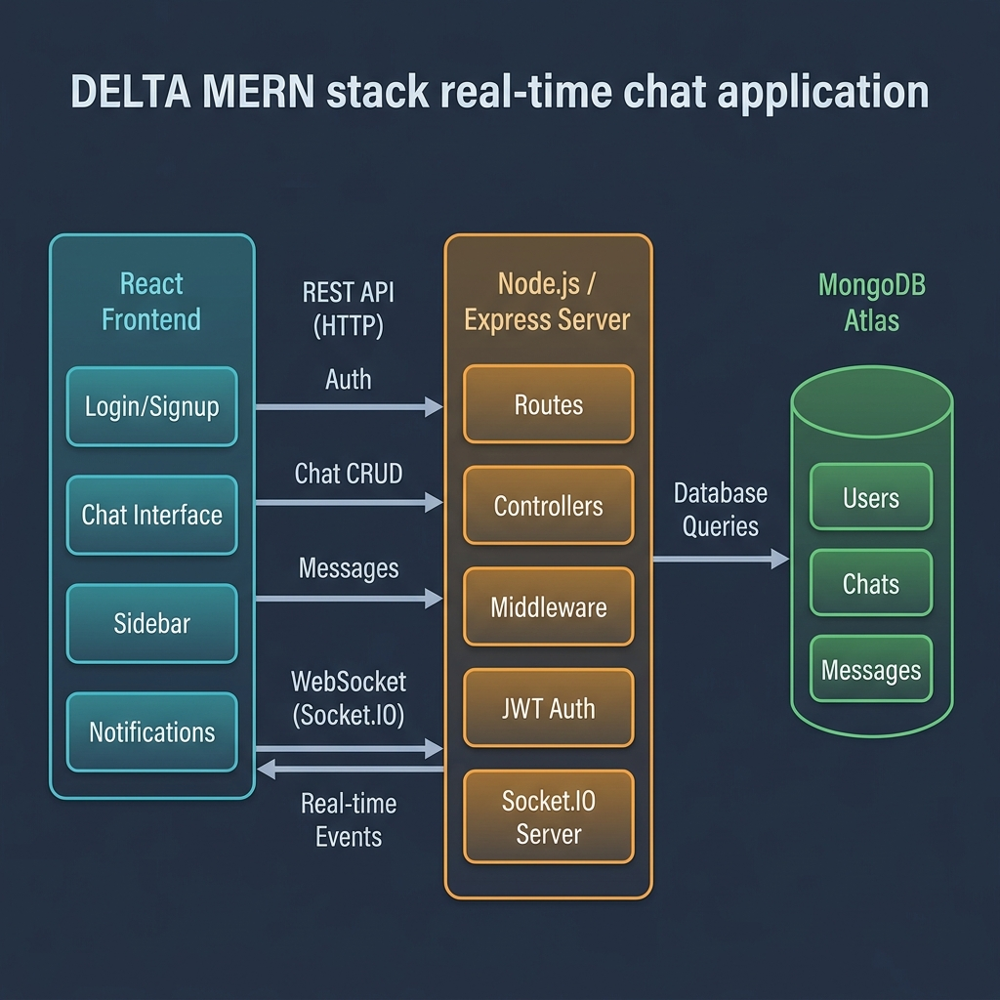
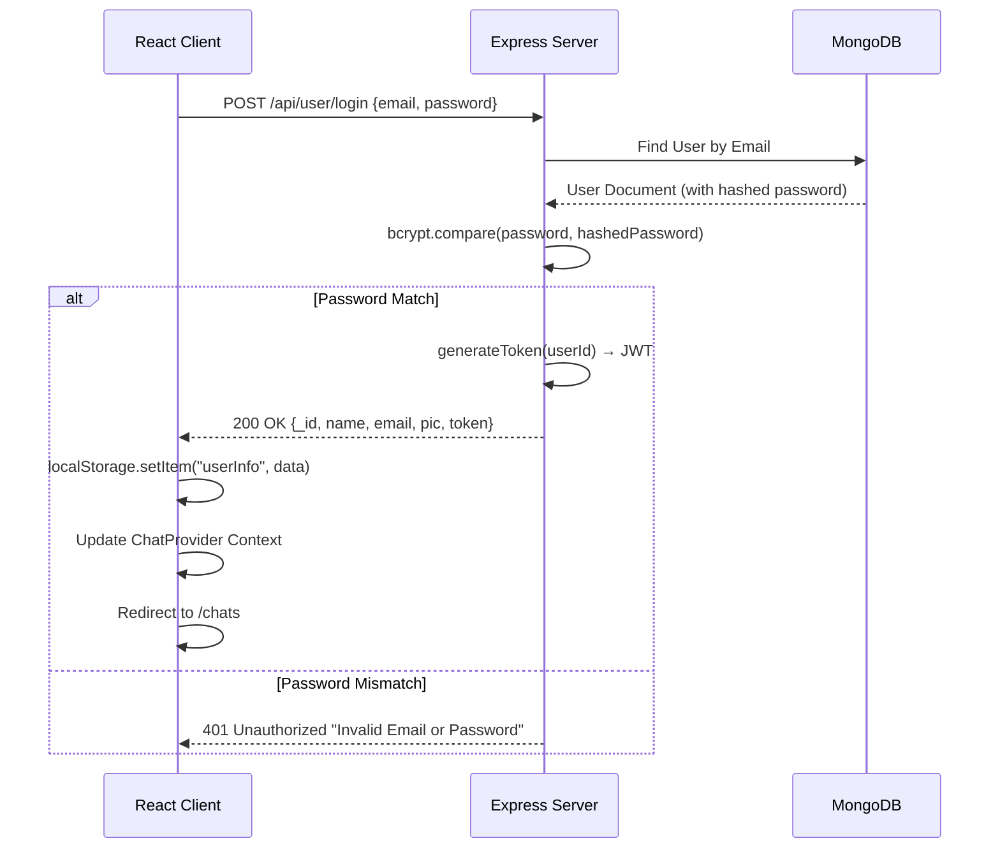
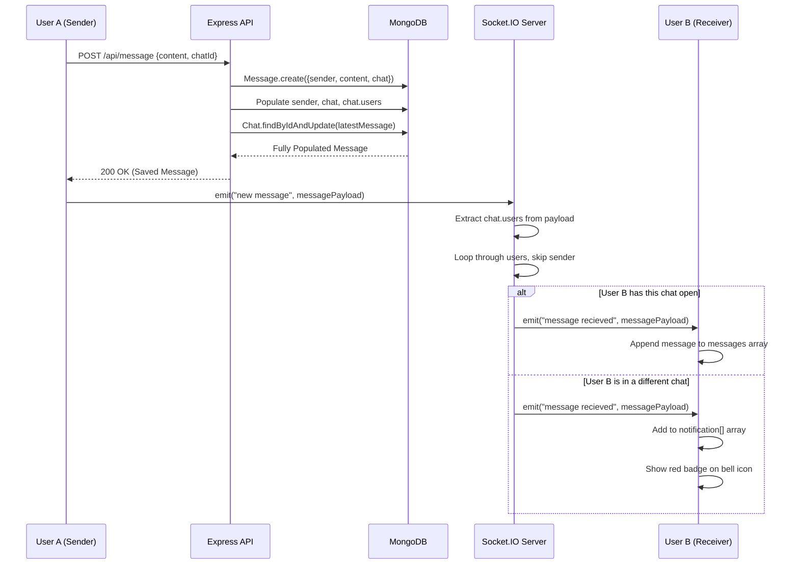
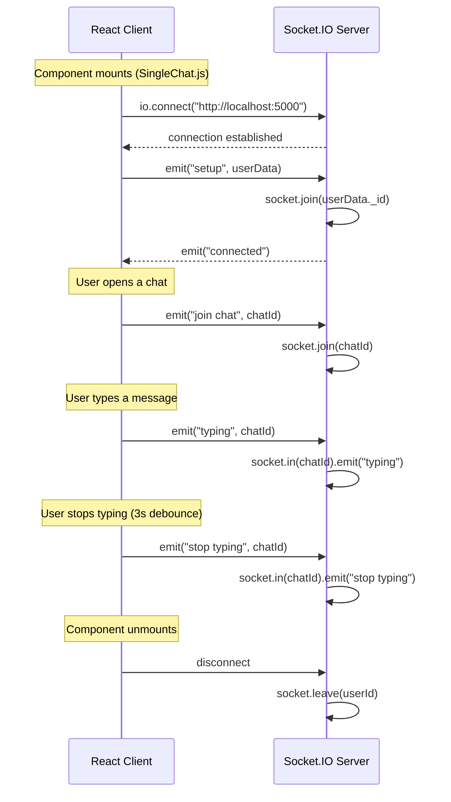
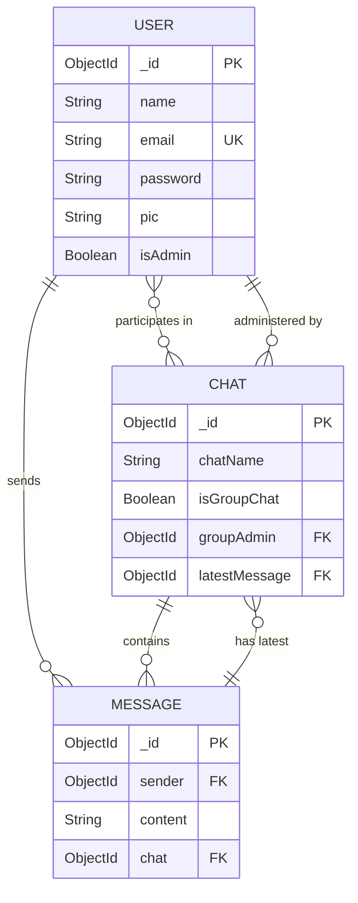

# DELTA_V1 — Architecture & Technical Documentation

> This document provides a deep, technical dive into the **DELTA_V1** real-time chat application. It is designed for developers, contributors, and recruiters who want to understand the system's inner workings, architecture, and design decisions.

---

## Table of Contents

- [A. Complete System Architecture](#a-complete-system-architecture)
- [B. Workflow Diagrams](#b-workflow-diagrams)
- [C. Folder-by-Folder Explanation](#c-folder-by-folder-explanation)
- [D. Backend Deep Dive](#d-backend-deep-dive)
- [E. Frontend Deep Dive](#e-frontend-deep-dive)
- [F. Database Design](#f-database-design)
- [G. Security Overview](#g-security-overview)
- [H. Lessons Learned & Modernization Suggestions](#h-lessons-learned--modernization-suggestions)

---

## A. Complete System Architecture

DELTA_V1 follows a standard **MERN Stack** (MongoDB, Express, React, Node.js) architecture augmented with **Socket.IO** for real-time bidirectional communication.

### Architecture Overview



### Three-Tier Breakdown

| Tier | Technology | Responsibility |
|------|-----------|----------------|
| **Client** | React + Chakra UI | UI rendering, state management (Context API), WebSocket client |
| **Server** | Node.js + Express | REST API, JWT authentication, Socket.IO event handling |
| **Database** | MongoDB Atlas | Persistent storage for Users, Chats, and Messages |

### Request-Response Lifecycle (Standard API Call)

```
1. Client makes HTTP REST call (e.g., GET /api/chat)
2. Express Router intercepts the request
3. authMiddleware verifies the JWT token from Authorization header
4. Controller handles business logic, queries MongoDB via Mongoose models
5. JSON response is sent back to the client
```

### Real-Time Communication Architecture

The real-time layer operates **independently from the REST API** using persistent WebSocket connections:

- **Personal Rooms**: On `setup`, each client joins a Socket.IO room named after their unique `userId`. This allows the server to target specific users regardless of which chat they currently have open.
- **Chat Rooms**: When a user opens a specific chat, they emit a `join chat` event to join a room specific to that `chatId` (used for typing indicators).
- **Message Dispatch**: When User A sends a message, it is first saved to the database via a POST request. User A's client then emits a `new message` socket event. The server receives this and broadcasts it to the personal rooms of all other participants in that chat.

---

## B. Workflow Diagrams

### 1. Authentication Flow



### 2. Real-Time Message Sending Flow



### 3. Socket.IO Connection Lifecycle



### 4. Database Entity Relationships



---

## C. Folder-by-Folder Explanation

### Root Directory

| File/Folder | Purpose |
|-------------|---------|
| `.env` | Environment variables (Port, MongoDB URI, JWT Secret) |
| `.gitignore` | Prevents sensitive files and `node_modules` from being pushed to Git |
| `package.json` | Root dependencies (backend tools) and the `npm start` script |
| `README.md` | Public-facing project overview |
| `PROJECT_DOCUMENTATION.md` | This deep technical documentation |

### `/backend`

| File/Folder | Purpose |
|-------------|---------|
| `/config/db.js` | Establishes the Mongoose connection to MongoDB Atlas |
| `/config/generateToken.js` | Creates signed JWT tokens with user ID payload |
| `/controllers/userControllers.js` | Login, signup, and user search logic |
| `/controllers/chatControllers.js` | Create/fetch chats, manage group membership |
| `/controllers/messageControllers.js` | Send messages and fetch messages by chat ID |
| `/middleware/authMiddleware.js` | Validates JWT Bearer tokens on protected routes |
| `/middleware/errorMiddleware.js` | Custom 404 and general error handlers |
| `/models/userModel.js` | User schema with bcrypt pre-save hook |
| `/models/chatModel.js` | Chat schema with user/admin/message references |
| `/models/messageModel.js` | Message schema with sender/chat references |
| `/routes/userRoutes.js` | Maps `/api/user` endpoints to controllers |
| `/routes/chatRoutes.js` | Maps `/api/chat` endpoints to controllers |
| `/routes/messageRoutes.js` | Maps `/api/message` endpoints to controllers |
| `server.js` | Main entry point: Express app, middleware, routes, Socket.IO |

### `/frontend/src`

| File/Folder | Purpose |
|-------------|---------|
| `/components/Authentication/` | Login and Signup form components |
| `/components/miscellaneous/` | SideDrawer, ProfileModal, GroupChatModal, UpdateGroupChatModal |
| `/components/SingleChat.js` | **Core component**: message display, socket events, typing indicators |
| `/components/MyChats.js` | Sidebar listing all conversations with preview text |
| `/components/Chatbox.js` | Wrapper that conditionally renders SingleChat |
| `/components/ScrollableChat.js` | Auto-scrolling chat message container |
| `/components/ProtectedRoute.js` | Route guard that redirects unauthenticated users |
| `/Context/ChatProvider.js` | React Context for global state (user, chats, notifications) |
| `/Pages/Homepage.js` | Login/Signup page |
| `/Pages/ChatPage.js` | Main chat interface (SideDrawer + MyChats + Chatbox) |
| `/config/ChatLogics.js` | Helper functions for message layout and sender identification |
| `/hooks/useThemeColors.js` | Custom hook for Chakra UI dark/light mode color tokens |

---

## D. Backend Deep Dive

### API Endpoints

| Method | Endpoint | Auth | Description |
|--------|----------|------|-------------|
| `POST` | `/api/user` | ❌ | Register a new user |
| `POST` | `/api/user/login` | ❌ | Authenticate and get JWT token |
| `GET` | `/api/user?search=` | ✅ | Search users by name/email |
| `POST` | `/api/chat` | ✅ | Access or create a 1-on-1 chat |
| `GET` | `/api/chat` | ✅ | Fetch all chats for logged-in user |
| `POST` | `/api/chat/group` | ✅ | Create a group chat |
| `PUT` | `/api/chat/rename` | ✅ | Rename a group chat |
| `PUT` | `/api/chat/groupremove` | ✅ | Remove user from group |
| `PUT` | `/api/chat/groupadd` | ✅ | Add user to group |
| `GET` | `/api/message/:chatId` | ✅ | Fetch all messages for a chat |
| `POST` | `/api/message` | ✅ | Send a new message |

### Authentication Strategy

Uses **JSON Web Tokens (JWT)**:

1. On login/signup, the server creates a JWT signed with `JWT_SECRET`, storing the user's `_id` in the payload.
2. Protected routes use the `protect` middleware which:
   - Extracts the Bearer token from the `Authorization` header
   - Decodes and verifies it with `jwt.verify()`
   - Fetches the user from MongoDB (excluding the password field)
   - Attaches the user to `req.user` for downstream controllers

### Socket.IO Events

| Event | Direction | Payload | Purpose |
|-------|-----------|---------|---------|
| `setup` | Client → Server | `userData` | Join personal room (userId) |
| `connected` | Server → Client | — | Confirm socket connection |
| `join chat` | Client → Server | `chatId` | Join a specific chat room |
| `typing` | Client → Server | `chatId` | Notify others user is typing |
| `stop typing` | Client → Server | `chatId` | Notify others user stopped typing |
| `new message` | Client → Server | `messagePayload` | Broadcast new message to recipients |
| `message recieved` | Server → Client | `messagePayload` | Deliver message to recipient |

---

## E. Frontend Deep Dive

### State Management

The app uses **React Context API** (`ChatProvider`) instead of Redux. It manages:

| State Variable | Type | Purpose |
|----------------|------|---------|
| `user` | Object | Authenticated user credentials and JWT token |
| `selectedChat` | Object | The currently open conversation |
| `chats` | Array | List of all conversations for the sidebar |
| `notification` | Array | Unread messages for the notification bell |

### Key Component Interactions

```
ChatPage
├── SideDrawer (top navbar: search, dark mode, notifications, profile)
├── MyChats (left sidebar: conversation list)
└── Chatbox
    └── SingleChat (chat window: messages, typing indicator, input)
        ├── ScrollableChat (auto-scrolling message list)
        ├── Socket.IO connection & event handlers
        └── Typing indicator (Lottie animation)
```

### Real-Time Updates in SingleChat.js

This component is the **heart of real-time logic**:

- **Socket Connection**: On mount, creates a persistent Socket.IO connection and emits `setup`.
- **Message Listener**: Uses refs (`notificationRef`, `selectedChatRef`) to avoid stale closures. The `message recieved` handler is registered once on mount.
- **Duplicate Prevention**: Checks `notificationRef.current.some(n => n._id === newMsg._id)` instead of reference equality.
- **Typing Indicators**: Uses a `setTimeout` debouncer (3 seconds) to emit `stop typing` after the user pauses.

---

## F. Database Design

### Collections Overview

| Collection | Document Count Pattern | Purpose |
|------------|----------------------|---------|
| `users` | Grows with signups | Stores user credentials and profiles |
| `chats` | Grows with new conversations | Stores conversation metadata and participants |
| `messages` | Grows rapidly | Stores every message ever sent |

### Relationships

- **User ↔ Chat**: Many-to-Many (a user can be in many chats, a chat has many users)
- **Chat → Message**: One-to-Many (a chat contains many messages)
- **User → Message**: One-to-Many (a user sends many messages)
- **Chat → User (Admin)**: Many-to-One (a group chat has one admin)
- **Chat → Message (Latest)**: One-to-One reference for sidebar preview

### Indexing

- `User.email` has a `unique` constraint for preventing duplicate accounts.
- All `ObjectId` references are automatically indexed by MongoDB.

---

## G. Security Overview

### ✅ Current Protections

| Protection | Implementation |
|------------|---------------|
| Password Hashing | bcryptjs with salt factor 10, applied via Mongoose pre-save hook |
| Stateless Auth | JWT tokens prevent the need for server-side sessions |
| Route Protection | `protect` middleware blocks unauthenticated API access |
| Input Validation | Mongoose schema validation rejects malformed data |

### ⚠️ Existing Weaknesses

| Vulnerability | Risk Level | Description | Suggested Fix |
|---------------|-----------|-------------|---------------|
| LocalStorage Token | Medium | XSS attacks can steal JWT from localStorage | Use HttpOnly cookies |
| No Rate Limiting | Medium | Susceptible to brute-force login attacks | Add `express-rate-limit` |
| Socket Auth Gap | High | Socket accepts userId from client without JWT verification | Add Socket.IO JWT middleware |
| No Input Sanitization | Low | User-submitted text is rendered without sanitization | Add DOMPurify or similar |

---

## H. Lessons Learned & Modernization Suggestions

DELTA_V1 was an excellent learning project. Analyzing it reveals several architectural patterns that can be improved for a production-ready application:

### 1. Separation of Concerns (Backend)

**Current**: Mongoose queries are embedded directly inside Express controllers.
**Improvement**: Implement a **Service layer**. Controllers handle HTTP req/res only; services handle database interactions. This makes the code testable and reusable.

### 2. State Management (Frontend)

**Current**: Context API works for this scale but triggers widespread re-renders when `chats` or `notification` arrays update.
**Improvement**: Adopt **Zustand** for lightweight global state or **React Query (TanStack Query)** for server-state caching. This provides granular re-rendering and automatic cache invalidation.

### 3. Scalability (WebSockets)

**Current**: If the backend scales to 2+ servers, WebSockets will break — a user on Server A can't receive socket events from Server B.
**Improvement**: Implement a **Redis Adapter** for Socket.IO (`@socket.io/redis-adapter`). This syncs socket events across multiple server instances.

### 4. Code Maintenance

**Current**: JavaScript with no type checking leads to runtime null-reference errors.
**Improvement**: Migrate the codebase to **TypeScript** to catch errors at compile-time and improve developer experience with auto-completion.

### 5. Message Performance

**Current**: All messages for a chat are loaded at once (`Message.find({ chat: chatId })`).
**Improvement**: Implement **cursor-based pagination** with infinite scroll. Load 50 messages at a time and fetch more as the user scrolls up.

---

*This documentation was generated through deep analysis of the DELTA_V1 codebase. For a quick overview, see the [README.md](README.md).*
